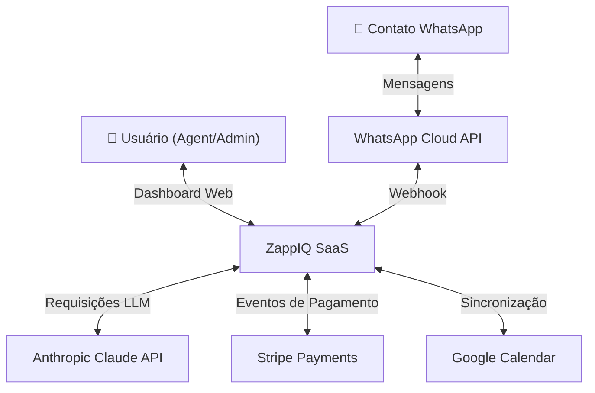

# Arquitetura ZappIQ

## Visão Geral

ZappIQ é uma plataforma SaaS B2B de automação conversacional para WhatsApp Business. Utiliza modelo de microsserviços com orquestração assíncrona, integração com LLM (Anthropic Claude), e isolamento multilocatário via Row-Level Security (RLS) no PostgreSQL.

## Modelo C4

### 1. Contexto (Context)



**Atores:**
- **Usuário:** Gestor de conversas, supervisor, administrador. Acessa dashboard web, gerencia fluxos, consulta analytics.
- **Contato:** Cliente final que interage via WhatsApp Business.
- **Sistemas Externos:** WhatsApp (webhook de mensagens), Anthropic (geração de respostas), Stripe (cobranças), Google Calendar (agendamentos).

### 2. Container (Componentes Principais)

```mermaid
graph TB
    subgraph Client["Cliente"]
        Web["🌐 Next.js Web<br/>Vercel | Standalone"]
    end
    
    subgraph API["API e Processamento"]
        APIServer["API Express<br/>Fly.io"]
        Redis["Redis<br/>Upstash"]
        Queue["BullMQ Queues<br/>message-queue<br/>llm-queue"]
        Worker["LLM Worker<br/>async processor"]
    end
    
    subgraph Data["Persistência e Vectores"]
        Postgres["PostgreSQL 15<br/>Supabase"]
        pgvector["pgvector<br/>embeddings"]
    end
    
    subgraph RAG["Inteligência"]
        RAGService["Python RAG Service<br/>FastAPI | Fly.io"]
    end
    
    subgraph External["Integrações Externas"]
        WhatsAppAPI["WhatsApp Cloud API"]
        AnthropicAPI["Anthropic Claude"]
        StripeAPI["Stripe API"]
        GoogleAPI["Google Calendar API"]
    end
    
    Web -->|HTTP/WebSocket| APIServer
    APIServer -->|Read/Write| Postgres
    Postgres -->|vector ops| pgvector
    APIServer -->|Enqueue| Queue
    Queue -->|Consume| Worker
    APIServer -->|Consume| Worker
    Worker -->|Embeddings| RAGService
    Worker -->|API Call| AnthropicAPI
    AnthropicAPI -->|Response| Worker
    Worker -->|Write response| Postgres
    APIServer -->|Webhook (POST)| WhatsAppAPI
    WhatsAppAPI -->|Webhook (POST)| APIServer
    APIServer -->|API Call| StripeAPI
    APIServer -->|API Call| GoogleAPI
    RAGService -->|Query| Postgres
    RAGService -->|vector search| pgvector
```

**Componentes:**

| Componente | Função | Tecnologia |
|---|---|---|
| **Next.js Web** | Dashboard, CRM leve, fluxos, analytics | Next.js 14, React 18, Zustand, Recharts, Socket.IO |
| **API Express** | Orchestração, roteamento, webhooks, autenticação | Node 20, Express, TypeScript, Helmet, Winston |
| **Redis + BullMQ** | Filas assíncronas, cache, sessões | Redis via Upstash, BullMQ workers |
| **PostgreSQL + pgvector** | Dados transacionais, audit log (RLS), embeddings | Postgres 15, Prisma ORM, uuid-ossp |
| **RAG Service** | Recuperação de contexto, embeddings | Python 3.12, FastAPI, LangChain, Ollama/HF |
| **Integração Ext.** | APIs de terceiros (WhatsApp, Stripe, Anthropic) | HTTP, OAuth 2.0, JWT |

---

## Fluxo de Mensagem (Detalhado)

### Cenário: Contato envia mensagem via WhatsApp → ZappIQ → Resposta automática

```
1. INBOUND (WhatsApp → API)
   ├─ [WhatsApp Cloud] Contato envia "Qual é o preço?"
   ├─ [Webhook POST /api/webhook] Meta valida assinatura X-Hub-Signature SHA-256
   ├─ [API] Verifica assinatura, parseia payload
   └─ Enqueue em "message-queue" (BullMQ)

2. MESSAGE PROCESSING (Worker)
   ├─ [Worker] Dequeue da "message-queue"
   ├─ [Prisma] Cria Contact se novo, marca Conversation como OPEN
   ├─ [Prisma] Persiste Message (direction=INBOUND, isFromBot=false)
   ├─ [Socket.IO] Notifica dashboard → agent vê nova msg em tempo real
   └─ Enqueue em "llm-queue"

3. LLM + RAG (Worker)
   ├─ [Worker] Dequeue da "llm-queue"
   ├─ [RAG Service] QueryVector: busca embeddings similares (FAQ, docs)
   ├─ [RAG Service] Retorna contexto relevante (ex: página de preços)
   ├─ [Anthropic API] Claude recebe:
   │  ├─ System prompt (persona)
   │  ├─ Histórico de conversa (últimas N msgs)
   │  └─ Context retrieval
   ├─ [Anthropic] Retorna resposta gerada
   └─ Enqueue em "whatsapp-queue"

4. OUTBOUND (API → WhatsApp)
   ├─ [Worker] Dequeue da "whatsapp-queue"
   ├─ [Prisma] Cria Message (direction=OUTBOUND, isFromBot=true, status=SENT)
   ├─ [WhatsApp Cloud API] Send message via Cloud API
   ├─ [WhatsApp] Retorna message_id (webhook status=DELIVERED/READ)
   ├─ [Prisma] Atualiza Message.status = DELIVERED/READ
   └─ [Socket.IO] Notifica dashboard → msg atualizada em tempo real

5. AUDIT LOG (Paralelo)
   ├─ [AuditLog] Registra action="conversation.message.inbound"
   ├─ [AuditLog] hash = SHA-256(this + prevHash) → cadeia tamper-evident
   ├─ [AuditLog] dataSubjectId = contactId (LGPD Art. 37)
   └─ [AuditLog] purpose = "customer_service"
```

**Isolamento Multi-Tenant:**
Todas as operações rodam no contexto de uma `organizationId` extraída do JWT. Middleware `tenantContext` injeta `SET LOCAL app.current_workspace_id = <org>` no Prisma, ativando RLS.

---

## Componente: Camada de Dados

### Schema Multi-Tenant (Prisma)

| Model | Tenancy | Features LGPD |
|---|---|---|
| **Organization** | Root (ID único) | `dpoEmail` (Art. 41), retenção configurável |
| **User** | via `organizationId` | RLS + auditLogsRelation |
| **Contact** | via `organizationId` | `consentMarketing`, soft-delete |
| **Conversation** | via `organizationId` | `deletedAt` (soft), `anonymizedAt` (Art. 16), RLS |
| **Message** | via `organizationId` | `isFromBot`, `aiConfidence`, soft-delete via Conversation |
| **AuditLog** | via `organizationId` | Hash chain, `before/after` snapshots, `legalBasis` |
| **DataSubjectRequest** | via `organizationId` | Art. 18 (DSR), status tracking, prazo de 15d |
| **KBChunk** | via `organizationId` + doc | `embedding` (pgvector 1536-dim) |

**Row-Level Security (RLS):**
```sql
ALTER TABLE "Conversation" ENABLE ROW LEVEL SECURITY;
CREATE POLICY tenant_isolation ON "Conversation"
  USING (organizationId::text = current_setting('app.current_workspace_id'));
```

Middleware Express executa `SET LOCAL` antes de cada Prisma query.

---

## Componente: Autenticação e Autorização

1. **Signup/Login:**
   - POST `/api/auth/register` → hash senha (bcrypt), gera `organizationId`, emite JWT
   - POST `/api/auth/login` → valida credenciais, emite JWT (exp=15m) + refresh token (exp=7d)

2. **JWT:**
   - Payload: `{ userId, organizationId, role }`
   - Header: `Authorization: Bearer <token>`
   - Verificação em `authMiddleware`, Socket.IO auth via `socket.handshake.auth.token`

3. **Roles (RBAC):**
   - **ADMIN:** gerencia org, usuários, billing
   - **SUPERVISOR:** analisa analytics, atribui conversas
   - **AGENT:** responde conversas, vê contatos, templates
   - **AUDITOR:** read-only em audit logs, DSR

4. **Rate Limiting:**
   - Global: 500 req/15min (todos os `/api`)
   - Auth: 10 req/15min (login/register por IP)
   - Per-workspace: via Redis (futuro para escala)

---

## Componente: Cache e Filas Assíncronas

### BullMQ Queues

| Fila | Worker | Timeout | Retry |
|---|---|---|---|
| **message-queue** | MessageProcessor | 30s | 3x exponential |
| **llm-queue** | LLMWorker | 60s | 2x exponential |
| **whatsapp-queue** | WhatsAppSender | 30s | 5x (crítico) |
| **campaign-queue** | CampaignBatcher | 120s | 1x |
| **embed-queue** | EmbedWorker | 120s | 1x |

### Redis Cache Patterns

- **Session:** `session:<userId>` → TTL 7d
- **Rate limit:** `ratelimit:<org>:<endpoint>` → TTL 15m
- **Conversation state:** `conv:<conversationId>:state` → TTL 1h
- **Template cache:** `template:<templateId>` → TTL 24h

---

## Componente: Observabilidade e Logging

### Winston Logger

```typescript
// Structured JSON em produção
{
  timestamp: "2026-04-13T...",
  level: "info",
  service: "zappiq-api",
  traceId: "<otel-trace>",
  spanId: "<otel-span>",
  message: "Message processed",
  organizationId: "org_xyz",
  conversationId: "conv_abc",
  duration_ms: 234
}
```

### OpenTelemetry

- **Traces:** RequestProcessor → LLM call → DB write
- **Metrics:** latência (p50, p95, p99), throughput por workspace, error rate
- **Exporta para:** Axiom (dev) | CloudWatch (AWS) | Cloud Logging (GCP)

### Health Checks

- `GET /health` → `{ status, version, uptime }` (liveness)
- `GET /ready` → verifica Postgres, Redis, Anthropic connectivity (readiness)

---

## Decisões Arquiteturais Registradas (ADRs)

Vide `docs/adr/` para decisões registradas:

1. **ADR-0001: Multi-Tenancy via RLS** — isolamento forte no DB em vez de segregação de aplicação
2. **ADR-0002: BullMQ para Filas** — Redis-backed, typed, sem MQ complexa
3. **ADR-0003: Socket.IO para Real-Time** — broadcast por org room, WebSocket com fallback
4. **ADR-0004: Soft Delete + Audit Log** — LGPD compliance, forense, retenção configurável
5. **ADR-0005: Standalone Next.js** — self-hosted em Fly.io, sem Vercel do lado da API (futura migração para AWS/GCP)

---

## Stack Tecnológico

### Frontend
| Biblioteca | Versão | Função |
|---|---|---|
| Next.js | 14.x | Server-side rendering, API routes |
| React | 18.x | UI components |
| Zustand | 4.x | State management |
| Tailwind CSS | 3.x | Styling |
| Recharts | 2.x | Charts (analytics) |
| Socket.IO Client | 4.x | Real-time updates |

### Backend
| Tecnologia | Versão | Função |
|---|---|---|
| Node.js | 20.x | Runtime |
| Express | 4.x | HTTP framework |
| TypeScript | 5.x | Type safety |
| Prisma | 6.x | ORM + migrations |
| BullMQ | 5.x | Job queues |
| Socket.IO | 4.x | WebSocket |
| Winston | 3.x | Logging |
| Helmet | 7.x | Security headers |
| Rate-limit | 7.x | Request throttling |

### Banco de Dados
| Componente | Versão | Função |
|---|---|---|
| PostgreSQL | 15.x | OLTP, RLS |
| pgvector | 0.6.x | Vector embeddings (1536-dim) |
| uuid-ossp | - | UUID generation |
| Prisma Client | 6.x | Query builder, migration runner |

### Cloud & Deploy
| Serviço | Função |
|---|---|
| Fly.io | API + RAG containers (gru region) |
| Vercel | Web frontend (next standalone) |
| Supabase | PostgreSQL managed + vector |
| Upstash | Redis serverless |
| Cloudflare | DNS, TLS, CDN (futuro) |

### Integrações Externas
| API | Auth | Rate Limit |
|---|---|---|
| Anthropic Claude | API Key | 100 req/min (tier dependent) |
| WhatsApp Cloud | Webhook + access token | 1000 req/sec (app-level) |
| Stripe | Webhook secret, API key | 100 req/sec (account-level) |
| Google Calendar | OAuth 2.0 | 5000 req/day (free) |

---

## Segurança e Conformidade

### LGPD (Lei Geral de Proteção de Dados)

| Artigo | Implementação |
|---|---|
| **Art. 7 (Base Legal)** | Enum `LegalBasis` em AuditLog (CONSENT, CONTRACT, LEGAL_OBLIGATION, etc.) |
| **Art. 11 (Dados Sensíveis)** | Suporte a HEALTH_PROTECTION, segregação de processamento |
| **Art. 16 (Direito ao Esquecimento)** | Soft delete + anonimização (anonymizedAt) |
| **Art. 18 (DSR — Data Subject Request)** | Portal em `/api/dsr`, tipos: ACCESS, CORRECTION, DELETION, PORTABILITY |
| **Art. 37 (ROPA)** | Audit log tamper-evident com SHA-256 hash chain |
| **Art. 41 (DPO)** | Campo `dpoEmail` em Organization |
| **Art. 46 (Segurança)** | Helmet headers, rate limiting, JWT, HTTPS obrigatório |
| **Art. 48 (Incidentes)** | AuditLog registra todas as ações críticas |

### Criptografia

- **Em trânsito:** HTTPS/TLS (Fly.io + Cloudflare)
- **Em repouso:** PostgreSQL encryption at rest (Supabase managed)
- **Hashing:** SHA-256 para audit log chain, bcrypt (cost=12) para senhas

### Isolamento de Dados

- RLS no PostgreSQL (policy por `organizationId`)
- JWT validação em cada request
- Socket.IO segregação por org room (`org:<id>`)

---

## Tratamento de Erros e Resiliência

### Padrão de Retry

```typescript
// BullMQ retry automático com backoff exponencial
const job = await messageQueue.add(
  'process-message',
  payload,
  {
    attempts: 3,
    backoff: { type: 'exponential', delay: 2000 },
    removeOnComplete: true,
  }
);
```

### Graceful Shutdown

```typescript
process.on('SIGTERM', async () => {
  logger.info('SIGTERM: draining connections...');
  await closeQueues();
  await prisma.$disconnect();
  httpServer.close(() => process.exit(0));
});
```

Timeout: 30 segundos (configurável em Fly).

### Circuit Breaker (Futuro)

Integração com bibliotecas como `opossum` para LLM/WhatsApp calls, fallback automático.

---

## Deployment Targets (Cloud Readiness)

### Atual (Free Tier)

| Componente | Provedor | Config |
|---|---|---|
| Web | Vercel Hobby | `.next/standalone` |
| API | Fly.io Free | `shared-cpu-1x, 512mb` |
| DB | Supabase Free | 500mb, backups 7d |
| Redis | Upstash Free | 10k commands/day |
| RAG | Fly.io Free | colocalizado com API |

### AWS (Migration Path)

| Componente | Serviço | Rationale |
|---|---|---|
| Web | S3 + CloudFront | static assets, global distribution |
| API | ECS Fargate | containers, auto-scaling, VPC |
| DB | RDS Postgres | managed, pgvector support, backups |
| Redis | ElastiCache | fully managed, high availability |
| RAG | ECS Fargate | low-latency retrieval |
| CDN | CloudFront | global edge, cache headers |
| Secrets | Secrets Manager | rotation, audit |

### GCP (Migration Path)

| Componente | Serviço | Rationale |
|---|---|---|
| Web | Cloud Run + Firebase Hosting | serverless, global CDN |
| API | Cloud Run (min-instances=1) | stateless, auto-scaling |
| DB | Cloud SQL Postgres | managed, pgvector extension |
| Redis | Memorystore | fully managed, replicated |
| RAG | Cloud Run | low-latency, regional |
| CDN | Cloud CDN | automatic, integrated with GCP |
| Secrets | Secret Manager | Google KMS encryption |

Vide `MIGRATION.md` para checklist detalhado e estimativas de custo.

---

## Próximos Passos

1. **RAG Service:** refinar embeddings, otimizar chunk size
2. **Observabilidade:** implementar traces end-to-end
3. **Cache Distribuído:** Redis patterns para escalabilidade
4. **Load Testing:** Apache JMeter, k6 para capacidade
5. **Disaster Recovery:** RPO/RTO, backup cross-region
