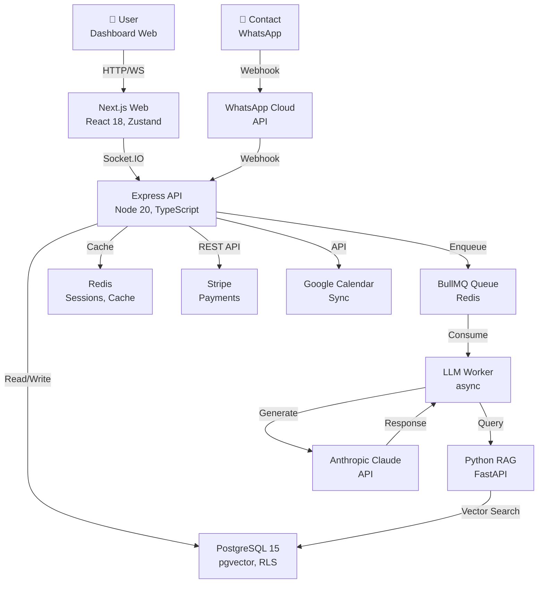

# ZappIQ

[](https://github.com/zappiq/zappiq/actions?query=branch%3Amain)
[](LICENSE)
[](https://nodejs.org/)
[](https://pnpm.io/)

**Automação conversacional B2B para WhatsApp Business com IA generativa e CRM integrado.**

ZappIQ é um SaaS de orquestração de conversas em WhatsApp que combina LLM (Anthropic Claude), retrieval-augmented generation (RAG), filas assíncronas e isolamento multilocatário com conformidade LGPD.

---

## Quickstart Local (Docker Compose)

### Pré-requisitos

- Docker + Docker Compose
- Node 20+ e pnpm 9.15+
- API keys: Anthropic, WhatsApp Business, Stripe (opcionais para dev)

### Setup

```bash
# Clone e instale dependências
git clone https://github.com/zappiq/zappiq.git
cd zappiq
pnpm install

# Copie .env.example para .env e preencha
cp .env.example .env
# Edite .env com suas chaves

# Levante stack local
docker compose up -d

# Aguarde ~10s, depois crie usuário admin
curl -X POST http://localhost:3001/api/auth/register \
  -H "Content-Type: application/json" \
  -d '{
    "email": "admin@zappiq.local",
    "password": "SecurePass123!",
    "name": "Admin Local"
  }'

# Acesse dashboard
# http://localhost:3003
```

**O que sobe:**
- PostgreSQL 15 (port 5432)
- Redis (port 6379)
- API Express (port 3001, http://localhost:3001/health)
- Next.js Web (port 3003, http://localhost:3003)
- Nginx reverse proxy (port 80)

---

## Quickstart Cloud (Produção)

Siga [DEPLOY.md](./DEPLOY.md) para primeiro deploy em:
- Supabase (PostgreSQL + pgvector)
- Upstash (Redis)
- Fly.io (API Express)
- Vercel (Next.js Web)
- Cloudflare (DNS/CDN)

**Tempo:** ~2–3 horas, incluindo criação de contas e configuração de webhooks.

---

## Arquitetura de Alto Nível



**Fluxo de mensagem:**
1. Contato envia msg via WhatsApp → webhook chega em API
2. API valida assinatura Meta, enfileira em BullMQ
3. Worker dequeue, consulta RAG (embeddings + contexto)
4. Worker chama Claude com contexto + histórico
5. Claude gera resposta → Worker envia via WhatsApp Cloud API
6. WebSocket notifica dashboard em tempo real
7. Audit log registra com hash SHA-256 (LGPD)

---

## Stack Tecnológico

### Frontend

| Lib | Versão | Uso |
|---|---|---|
| Next.js | 14.x | SSR, App Router |
| React | 18.x | UI components |
| Tailwind CSS | 3.x | Styling |
| Zustand | 4.x | State management |
| Recharts | 2.x | Analytics charts |
| Socket.IO Client | 4.x | Real-time updates |

### Backend

| Lib | Versão | Uso |
|---|---|---|
| Express | 4.x | HTTP framework |
| TypeScript | 5.x | Type safety |
| Prisma | 6.x | ORM + migrations |
| BullMQ | 5.x | Job queues |
| Socket.IO | 4.x | WebSocket |
| Winston | 3.x | Structured logging |
| Helmet | 7.x | Security headers |

### Database & Cache

| Serviço | Versão | Uso |
|---|---|---|
| PostgreSQL | 15.x | OLTP, RLS |
| pgvector | 0.6.x | Vector embeddings (1536-dim) |
| Redis | 7.x | Cache, BullMQ backend |

### Cloud (Produção)

| Provedor | Serviço | Uso |
|---|---|---|
| Fly.io | Container (gru) | API + RAG |
| Vercel | Serverless | Web frontend |
| Supabase | Postgres managed | DB + backup |
| Upstash | Redis serverless | Queue backend |
| Cloudflare | CDN/DNS | Global edge, TLS |

---

## Estrutura do Monorepo

```
zappiq/
├── apps/
│   ├── api/                       # Express + TypeScript
│   │   ├── src/
│   │   │   ├── server.ts         # Entry point
│   │   │   ├── middleware/       # Auth, tenant context, rate limit
│   │   │   ├── routes/           # /api/... endpoints
│   │   │   ├── services/         # BullMQ, Prisma, external APIs
│   │   │   └── utils/            # Logger, crypto, validation
│   │   ├── Dockerfile            # Multi-stage, turbo prune
│   │   └── package.json
│   └── web/                       # Next.js 14, standalone
│       ├── app/                  # App Router
│       ├── components/           # React components
│       ├── lib/                  # Zustand stores, API client
│       ├── public/               # Static assets
│       ├── Dockerfile
│       └── package.json
├── packages/
│   ├── database/                 # Prisma ORM
│   │   ├── prisma/
│   │   │   ├── schema.prisma     # Models: User, Contact, Conversation, AuditLog, etc.
│   │   │   ├── migrations/       # Auto-generated by prisma
│   │   │   └── bootstrap.sql     # Extension setup (uuid-ossp, vector)
│   │   └── package.json
│   ├── shared/                   # Shared types, utils
│   │   └── src/
│   │       ├── types.ts          # Types (enums, interfaces)
│   │       └── validation.ts     # Zod schemas
│   └── ui/                       # Shared React components
│       └── src/
│           └── components/       # Button, Input, Modal, etc.
├── services/
│   └── rag/                      # Python FastAPI (if exists)
│       ├── main.py              # Entry point
│       ├── requirements.txt
│       ├── Dockerfile
│       └── services/            # Embeddings, retrieval
├── scripts/
│   ├── verify_rotation.sh        # Enforce secrets rotation
│   └── ...
├── .github/
│   └── workflows/
│       ├── ci.yml               # Lint, typecheck, build
│       ├── deploy-api.yml       # Deploy to Fly.io
│       └── deploy-web.yml       # Deploy to Vercel (auto)
├── docker-compose.yml           # Local dev stack
├── fly.toml                      # Fly.io config (API)
├── pnpm-workspace.yaml          # Workspace root
├── turbo.json                   # Turborepo cache config
├── tsconfig.base.json           # Root TypeScript config
├── .dockerignore                # Docker build ignore
├── .gitignore                   # Git ignore (LGPD: .env excluded)
├── ARCHITECTURE.md              # C4 model, fluxos, ADRs
├── DEPLOY.md                    # Runbook produção
├── MIGRATION.md                 # AWS/GCP roadmap
└── README.md                    # Este arquivo
```

---

## Scripts Principais

### Root

```bash
# Install all dependencies
pnpm install

# Dev: hot-reload all apps (requires docker compose up)
pnpm dev

# Build all apps
pnpm build

# Type-check all apps
pnpm typecheck

# Lint all apps
pnpm lint

# Database migrations
pnpm db:deploy      # Run migrations (production)
pnpm db:generate    # Generate Prisma client
pnpm db:seed        # Seed initial data (if exists)
```

### apps/api

```bash
pnpm --filter @zappiq/api dev    # dev on :3001
pnpm --filter @zappiq/api build  # compile to dist/
```

### apps/web

```bash
pnpm --filter @zappiq/web dev    # dev on :3003
pnpm --filter @zappiq/web build  # standalone in .next/
```

### packages/database

```bash
pnpm --filter @zappiq/database db:migrate     # Create migration
pnpm --filter @zappiq/database db:push        # Push schema
pnpm --filter @zappiq/database db:seed        # Load seed data
```

---

## Documentação Adicional

- **[ARCHITECTURE.md](./ARCHITECTURE.md)** — Modelo C4, fluxo de mensagem, componentes, decisões arquiteturais (ADRs)
- **[DEPLOY.md](./DEPLOY.md)** — Runbook passo-a-passo: Supabase → Upstash → Fly → Vercel → Cloudflare
- **[MIGRATION.md](./MIGRATION.md)** — Roadmap AWS/GCP: mapeamento componentes, estimativa custo (1k/10k/100k users), 10-phase checklist

---

## Conformidade e Segurança

### LGPD (Lei Geral de Proteção de Dados)

ZappIQ implementa:
- **Art. 16:** Soft delete + anonimização de dados pessoais
- **Art. 18:** Portal de DSR (Data Subject Request) para acesso, correção, exclusão
- **Art. 37:** Audit log tamper-evident com SHA-256 hash chain (ROPA)
- **Art. 41:** Campo DPO email em Organization
- **Art. 46:** Helmet security headers, rate limiting, HTTPS obrigatório
- **RLS:** Row-Level Security no PostgreSQL por organizationId

### Autenticação & Autorização

- JWT com `organizationId` no payload
- RBAC: ADMIN, SUPERVISOR, AGENT, AUDITOR
- Rate limiting: 500 req/15min global, 10 req/15min auth
- Socket.IO: segregação por org room

### Criptografia

- **Em trânsito:** HTTPS/TLS (Fly.io, Cloudflare)
- **Em repouso:** PostgreSQL encryption (Supabase managed)
- **Senhas:** bcrypt cost=12
- **API keys:** Armazenadas em secrets do provedor cloud

---

## Contribuindo

### Branch naming

```
feature/nome-da-feature
bugfix/nome-do-bug
chore/nome-da-tarefa
docs/nome-do-doc
```

### Commit convention

```
feat(scope): descrição curta
fix(scope): descrição curta
chore(scope): descrição curta
docs(scope): descrição curta
test(scope): descrição curta
refactor(scope): descrição curta

Descrição longa opcional.

Closes #123
```

**Exemplo:**
```
feat(api): add multi-language support for message templates

Implemented i18n using next-intl. All message templates now support
pt_BR, en_US, es_ES. DSR portal updated accordingly.

Closes #42
```

### Pre-commit hook

A suite do projeto inclui Husky + lint-staged (WIP). Antes de commit:
- `.env` files são rejeitados (via pre-commit hook)
- `pnpm lint` e `pnpm typecheck` rodam automaticamente

---

## Suporte e Contato

- **Issues:** GitHub Issues
- **Docs:** Vide ARCHITECTURE.md, DEPLOY.md, MIGRATION.md
- **Email:** devops@zappiq.com.br (admin)

---

## Licença

[MIT License](./LICENSE) — © 2026 ZappIQ.

---

## Status do Projeto

| Componente | Status | Alvo |
|---|---|---|
| **Core API** | ✓ Produção | v2.0 |
| **Web Dashboard** | ✓ Produção | v1.5 |
| **WhatsApp Integration** | ✓ Produção | v1.2 |
| **RAG + Embeddings** | ⚠️ Beta | MVP completo |
| **AWS Migration** | 📋 Planejado | Q3 2026 |
| **GCP Multi-Region** | 📋 Planejado | Q4 2026 |
| **Mobile App** | 📋 Backlog | 2027+ |

---

## Roadmap Próximos 6 Meses

- [ ] RAG service production-ready (chunk optimization, caching)
- [ ] Google Calendar sync full-featured
- [ ] Stripe webhook automation (invoice scheduling, dunning)
- [ ] Multi-language dashboard (i18n complete)
- [ ] AWS ECS migration (Phase 1–3)
- [ ] Observability full-stack (CloudWatch, X-Ray)
- [ ] Mobile native app (React Native)

---

**ZappIQ v2.0.0 — Build para escala com IA.**
